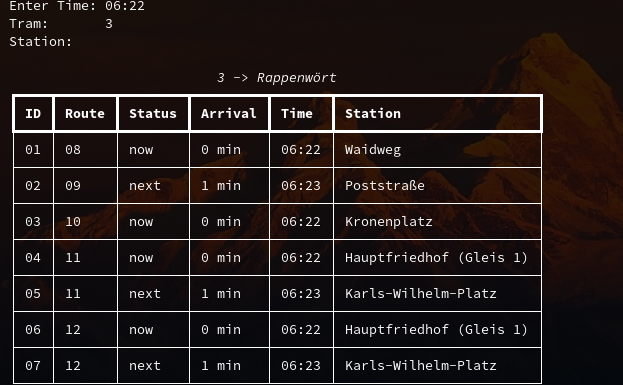

# TramPlanCLI

## Screenshot

## Description
This python program shows the tram connection of Karlsruhe.
You can enter the time, the tram number and the station.
This version isn't finish yet!

## Reqirements
- rich (pip install rich)

## Platform
- Linux
- Windows
- Mac
